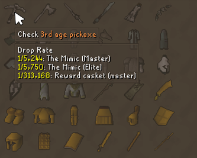

# Clog Drop Rates

A RuneLite plugin that shows drop rates and acquisition methods in a tooltip when hovering over items in the Collection Log.

## Features

- Hover any item in the Collection Log to see its drop rate
- Each rate group lists the sources that share that rate
- Sources with more than 3 entries are collapsed with a "+N more" indicator
- Multiple rate groups per item are shown when sources differ
- An "Acquirable Items" section shows how items can be obtained outside of drops — shop costs, minigame-reward currencies, and requirements (enabled by default)
- Slayer-task rates are annotated in green right on the drop lines (enabled by default): a drop whose rate improves while on a task shows the better rate inline (e.g. Basilisk jaw `1/5,000 (1/1,000 on task)`), and sources that only appear while on a task — superior monsters — are tagged `(task)` (e.g. Imbued heart's superiors, `3 × 1/512: Greater abyssal demon (task)`)
- For skilling pets, a "Skilling Pet" section shows your real per-action chance at your current level for each activity, best chance first (enabled by default)
- Optionally display drop rates as a percentage (e.g. 1/200 → 0.5%) instead of a ratio
- Optionally reduce awkward drop rate fractions to "1 in N" (e.g. 90/18,014 → ~1/200, 2 × 1/33 → ~1/17)
- Configurable cap on how many rate groups to display

## Configuration

**Drop Rates**

- **Show Drop Rates** *(default: on)* — Show the Drop Rate section.
- **Show as percentage** *(default: off)* — Show drop rates as a percentage (e.g. 1/200 → 0.5%) instead of a ratio; text rates like "Very rare" are left as-is.
- **Show as 1/N** *(default: on)* — Normalise awkward fractions to "1/N" (e.g. 90/18,014 → 1/200); ignored when percentage is on.
- **1/N decimal places** *(default: 1, range 0–3)* — Decimals kept in the N of a "1/N" rate (0 = whole number, e.g. `~1/181`; 1 = `1/181.1`). Matches the wiki's approximate rates more closely than rounding to a whole number.
- **Combine multi-roll rates** *(default: on)* — Merge rates rolled several times per kill (e.g. `3 × 1/6`) into a single rate; off keeps the `N ×` multiplier and formats each per-roll fraction with the settings above (e.g. `3 × 90/18,014` → `3 × ~1/200`).
- **Multi-roll combine method** *(default: Expected count)* — How combined rates are computed: **Expected count** uses `N × a/b` (the average number of drops per kill); **Chance per kill** uses `1 − (1 − a/b)^N` (the probability of getting at least one per kill, e.g. `3 × 1/6` → `~1/2.37`).
- **Show Slayer task rates** *(default: on)* — Annotate drops whose rate improves while on a Slayer task (e.g. `1/200 (1/100 on task)` on Tzrek-jad) and tag task-only sources — superior monsters — with `(task)`. When a regular monster and its superior share one line (e.g. Kurask + King kurask), only the superior is tagged.

**Skilling Pet Chances**

- **Show Skilling Pet Chances** *(default: on)* — For skilling pets, show your real per-action chance at your current level for each activity (best chance first).
- **Show popular methods only** *(default: off)* — Filter to popular training methods (from the wiki training guides).

**Acquirable Items**

- **Show Acquirable Items** *(default: on)* — Show the "Acquirable Items" section (shop costs, minigame-reward currencies, requirements).

**General**

- **Max sources shown** *(default: 7)* — Maximum rate groups shown per section (0 = unlimited).
- **Hide "Check" popup** *(default: on)* — Hide the cursor's "Check &lt;item&gt;" indicator on collection-log items.
- **Hide tooltip if obtained** *(default: off)* — Hide the tooltip for items you already own.

**UI Colors**

- **Header color** *(default: white)* — Section label colour, e.g. "Drop Rate:".
- **Item name color** *(default: orange #FFA21E)* — The hovered item's name in the header.
- **Rate / detail color** *(default: yellow #FFFF00)* — The rate / cost / requirement value before each source.
- **Source color** *(default: white)* — Source / monster / activity names.
- **Slayer task color** *(default: green #00BC00)* — On-task rate annotations and `(task)` tags.

---

IGN: Two Crocs
